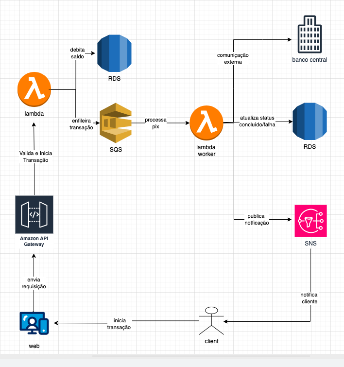

## Arquitetura de uma Transação Pix na AWS

Esse diagrama reflete como funciona uma transação Pix dentro de uma arquitetura de nuvem moderna e resiliente na AWS. O fluxo foi desenhado para garantir segurança, escalabilidade e a capacidade de processar transações de forma confiável, mesmo sob alta demanda.

O processo se inicia quando o **cliente**, através de uma aplicação web ou móvel, submete a requisição de um Pix. Essa requisição é recebida pelo **Amazon API Gateway**, que atua como a porta de entrada segura do sistema, validando e direcionando a chamada para uma **primeira função Lambda**.

Esta função Lambda inicial tem duas responsabilidades críticas: primeiro, ela se comunica com o banco de dados **RDS** para validar e debitar o saldo do cliente, registrando a transação com um status inicial, como "Pendente". Em seguida, para desacoplar os processos e garantir que nenhuma transação seja perdida, ela envia os detalhes da operação para uma fila no Amazon SQS.

Uma vez na fila, a transação aguarda para ser processada por um **"Lambda Worker"**, uma segunda função Lambda especializada. Este worker retira a mensagem da fila e executa a lógica principal: ele estabelece a **comunicação externa** com o sistema do Banco Central (SPI) para efetivar o Pix.

Após receber a confirmação de sucesso ou falha do Banco Central, o mesmo Lambda Worker finaliza o processo: ele **atualiza o status final da transação** no banco de dados **RDS** e, por fim, publica uma mensagem no **Amazon SNS**, um serviço de notificação. O SNS, por sua vez, é responsável por **enviar a notificação final ao cliente**, informando o resultado da operação e concluindo o ciclo da transação.

